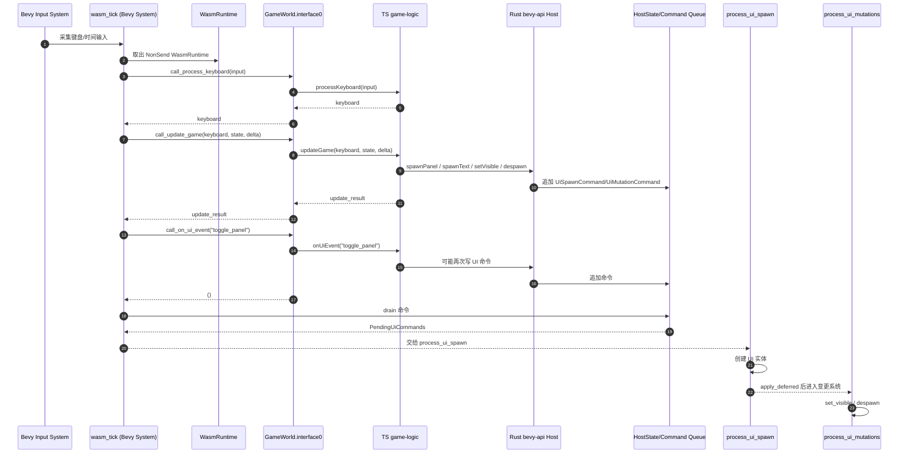
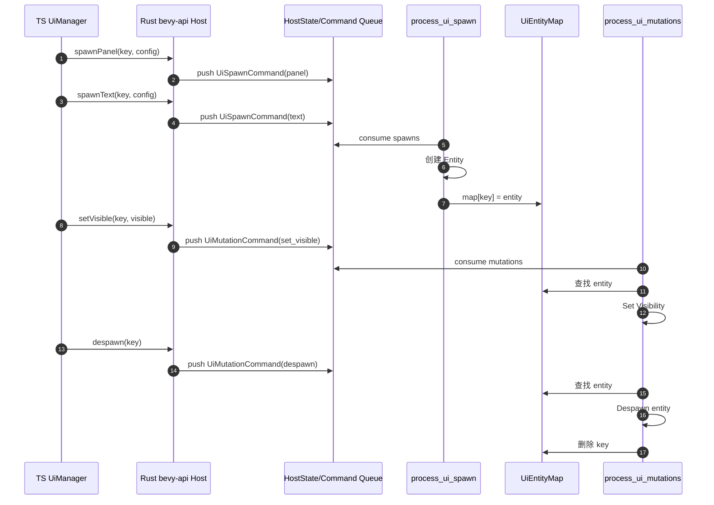
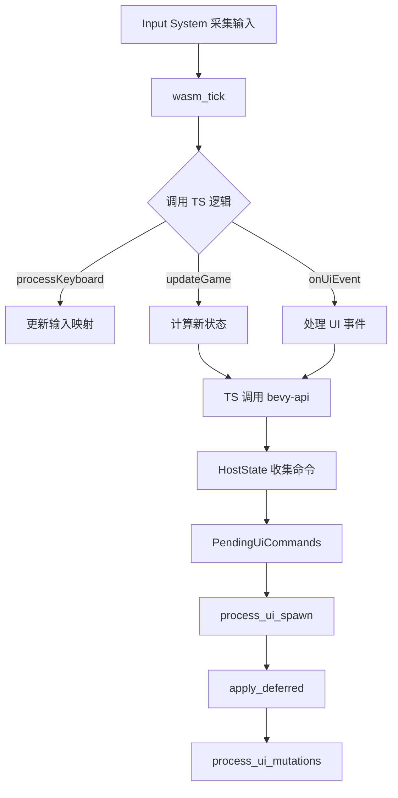
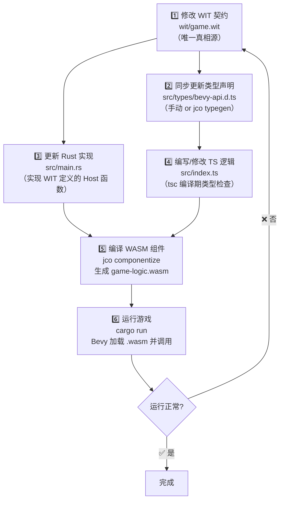

# Rust–TypeScript 通信架构设计文档（WASM Component Model）

## 〇、设计目标与原则

- **目标**：将可热更新的游戏逻辑放到 TypeScript/WASM 组件侧，同时保持 Rust 主线程 ECS/渲染的性能与安全性。
- **原则**：
  - **单一职责**：Rust 负责渲染/物理/ECS；TS 负责规则逻辑与 UI 行为。
  - **契约优先**：以 `WIT` 为唯一接口真相源，Rust 与 TS 由同一份契约生成绑定代码。
  - **无锁主线程**：WASM 运行时作为 `NonSend` 资源，仅在单一系统中访问，避免 `Mutex`。
  - **可扩展**：新增功能只需要改 `WIT` + TS 实现 + Rust Host 实现，不改通信框架核心。

---

## 一、整体架构

当前实现为 **Bevy（Rust）+ WASM Component Model（wasmtime）+ TypeScript（jco componentize）**：

```
┌──────────────────────────────────────────────────────────────────────────────┐
│  Bevy 主线程                                                                  │
│                                                                              │
│  wasm_tick ── call_process_keyboard / call_update_game / call_on_ui_event     │
│           └─ GameWorld.interface0（WIT 生成调用句柄）                          │
│                                                                              │
│  PendingUiCommands ── process_ui_spawn / process_ui_mutations                 │
│                                                                              │
└──────────────────────────────────────────────────────────────────────────────┘
                   │
                   │ WIT 定义的 Component 接口
                   ▼
┌──────────────────────────────────────────────────────────────────────────────┐
│  TypeScript WASM Component（由 jco componentize 生成）                         │
│                                                                              │
│  export game-logic：processKeyboard / updateGame / onUiEvent                  │
│  import bevy-api：spawnPanel / spawnText / setVisible / despawn / log          │
└──────────────────────────────────────────────────────────────────────────────┘
```

**关键变化**：不再使用 QuickJS、共享内存或 `sync_channel`。Rust 与 TS 之间通过 **WIT 生成的强类型接口** 直接调用，无需手写桥接代码。

---

## 二、核心契约：WIT（唯一真相源）

`WIT` 文件是 Rust 和 TS 双方的**唯一接口契约**，修改 WIT 后，Rust 与 TS 编译器都会强制报错，杜绝运行时不匹配。

- 文件位置：[game.wit](/Users/lingjieyu/Documents/test_game/wit/game.wit)
- 核心结构：
  - `interface bevy-api`：TS 调用 Rust（UI 操作、日志）
  - `interface game-logic`：Rust 调用 TS（键盘映射、位置更新、UI 事件）
  - `world game-world`：声明 import/export 方向

### 2.1 WIT 方向说明

- **export game-logic**：TS 实现，Rust 调用
- **import bevy-api**：Rust 实现，TS 调用

### 2.2 WIT 数据结构（示例）

```wit
record keyboard-input { right: bool, left: bool, up: bool, down: bool }
record player-state  { x: float32, y: float32, speed: float32 }
record update-result { x: float32, y: float32 }
```

### 2.3 WIT 的边界策略

- 数据类型尽量使用 **结构化 record**，避免手写内存布局。
- 复杂数据在 WIT 中显式建模（record、list、string），由绑定层自动处理序列化。

---

## 三、构建链路与自动生成

### 3.1 Rust 侧：wasmtime + bindgen

- `wasmtime::component::bindgen!` 读取 WIT，生成：
  - 强类型结构体（`KeyboardInput`、`PlayerState`、`PanelConfig` 等）
  - Host trait（`bevy-api` 的 Rust 接口）
  - Guest 调用句柄（`GameWorld.interface0.call_xxx`）

### 3.2 TS 侧：jco componentize

- `jco componentize` 读取 WIT：
  - 生成 TS 类型定义与 import glue 代码
  - 生成符合 Component Model 的 WASM Component

**结果**：任何字段或函数签名的改动都会引发双方编译错误，彻底消除运行时 FFI 失配问题。

---

## 四、Rust 侧模块职责

### 4.1 WasmRuntime（运行时容器）

- 文件位置：[main.rs](/Users/lingjieyu/Documents/test_game/src/main.rs)
- 结构：
  - `store: Store<HostState>`
  - `game_world: GameWorld`（WIT 生成的调用入口）

**关键点**：作为 `NonSend` 资源注册到 Bevy，确保只在主线程访问，避免 `Mutex`。

### 4.2 HostState（WIT Host 数据）

- 角色：TS 调用 `bevy-api` 时写入命令队列
- 字段：
  - `spawn_commands: Vec<UiSpawnCommand>`
  - `mutation_commands: Vec<UiMutationCommand>`

### 4.3 UI 命令队列与资源

- `UiSpawnCommand`：面板/文字创建
- `UiMutationCommand`：销毁/显隐
- `PendingUiCommands`：本帧待消费的 UI 命令缓冲区
- `UiEntityMap`：`key → Entity` 映射，解决 TS 不直接持有 `Entity` 的问题

### 4.4 SetVisible 实现说明

`SetVisible` 使用 Bevy 的 `Visibility` 组件控制显隐，**不修改 `Style` 组件**：

```rust
// ✅ 正确：只插入 Visibility，不影响 Style 中的 position/size 等字段
commands.entity(entity).insert(Visibility::Hidden);

// ❌ 错误（已修复）：插入 Style { display: None, ..default() } 会覆盖所有布局字段
```

### 4.5 UI Key 命名约定（强制）

子节点 key 必须以 `父key.` 为前缀，`Despawn` 时通过前缀批量清理子节点映射：

```
主面板：  main_panel
子文字：  main_panel.title
         main_panel.position
         main_panel.hint1
```

**禁止**使用下划线或其他分隔符替代点号，否则 `Despawn` 时子节点 key 不会被清理，导致 `UiEntityMap` 内存泄漏。

---

## 五、核心系统调度

### 5.1 系统链路（Update 阶段）

```
wasm_tick
  ├─ call_process_keyboard
  ├─ call_update_game
  ├─ call_on_ui_event
  └─ drain HostState 命令 → PendingUiCommands

process_ui_spawn
apply_deferred
process_ui_mutations
```

### 5.2 wasm_tick（唯一访问 WASM 的系统）

- 读取键盘输入
- 调用 `call_process_keyboard`，返回值**直接作为局部变量**传入下一步，不存入 `GameState`
- 调用 `call_update_game`，更新玩家位置
- 在 E 键触发时调用 `call_on_ui_event`
- 抽取 `HostState` 中的 UI 命令，转存到 `PendingUiCommands`

**设计目的**：集中 WASM 调用，避免多系统竞争同一个运行时资源。

**关于 `updateGame` 与 `bevy-api` 的约定**：
- `updateGame` 内部**允许**调用 `bevy-api`（如根据游戏状态自动弹出提示），产生的命令会在同帧 `drain` 时一并收集。
- `onUiEvent` 同理，所有 WASM 调用产生的命令统一在 `wasm_tick` 末尾 `drain`，保证顺序一致性。

### 5.3 process_ui_spawn

- 消费 `PendingUiCommands.spawns`
- 创建 UI 实体，并更新 `UiEntityMap`
- 每个 TS 侧 `key` 对应一个 Bevy `Entity`

### 5.4 process_ui_mutations

- 消费 `PendingUiCommands.mutations`
- 处理 `despawn`、`set-visible`
- 通过 `key` 找到 `Entity` 并执行操作

---

## 六、TypeScript 侧结构

文件位置：[index.ts](/Users/lingjieyu/Documents/test_game/game-logic/src/index.ts)

### 6.1 TS 侧导入能力

```ts
import { spawnPanel, spawnText, despawn, setVisible, log } from 'bevy:api/bevy-api'
```

这些 API 由 Rust 实现，TS 只调用，不直接接触 ECS。

### 6.2 导出函数（WIT contract）

- `processKeyboard(input)`
- `updateGame(keyboard, state, delta)`
- `onUiEvent(eventType)`

这些函数签名由 WIT 约束，TypeScript 编译器会强制检查。

### 6.3 UI 管理器（UiManager）

- `showPanel`：创建 UI 面板 + 文本节点
- `hidePanel`：隐藏 UI
- `destroyPanel`：销毁 UI
- `togglePanel`：根据 `lastPlayerState` 切换 UI 显示

**关键点**：使用字符串 `key` 管理 UI 组件，与 Rust 的 `UiEntityMap` 对应。

**状态字段设计**：`UiManager` 使用两个独立字段管理状态，避免语义混乱：

| 字段 | 含义 |
|------|------|
| `isCreated` | 实体是否已通过 `spawnPanel` 命令入队（不代表实体已写入 World） |
| `isVisible` | 当前是否处于可见状态 |

```
状态矩阵：
  isCreated=false, isVisible=false → 初始状态，showPanel 会创建实体
  isCreated=true,  isVisible=true  → 面板可见，showPanel 直接跳过
  isCreated=true,  isVisible=false → 面板已创建但隐藏，showPanel 只调用 setVisible
```

---

## 七、调用时序（核心流程）

```
Bevy 输入系统
  └─ wasm_tick
       ├─ call_process_keyboard(input) -> keyboard
       ├─ call_update_game(keyboard, state, delta) -> update_result
       ├─ call_on_ui_event("toggle_panel") (条件触发)
       └─ drain HostState 命令 → PendingUiCommands

process_ui_spawn / process_ui_mutations
  └─ 根据 PendingUiCommands 修改 ECS World
```

### 7.1 帧级时序图（详细）



### 7.2 事件触发与 UI 生命周期时序



### 7.3 逻辑流程图（模块级）



**重要保证**：`apply_deferred` 放在 spawn 与 mutation 之间，确保实体创建完成后再执行修改/销毁。

---

## 八、错误处理与诊断

- **WASM 调用错误**：在 `wasm_tick` 中捕获并输出 `eprintln!`，避免整个游戏崩溃。`call_process_keyboard` 失败时降级使用原始输入，保证游戏不卡死。
- **UI Key 不存在**：在 `process_ui_spawn` / `process_ui_mutations` 中输出错误日志。
- **日志分级**：TS 侧 `log()` 使用 `bevy::log::debug!` 输出，发布版本自动关闭，避免生产环境性能损耗。开发时可通过 `RUST_LOG=debug` 开启。

---

## 九、性能与并发策略

- **无锁**：`WasmRuntime` 仅作为 `NonSend` 资源在主线程访问。
- **低开销调用**：WIT 自动生成的调用是静态绑定，避免手写序列化/反序列化。
- **指令收拢**：UI 命令统一进入 `PendingUiCommands`，避免在 WASM 调用过程中直接操作 ECS。

---

## 十、扩展指南

### 10.1 新增 TS → Rust 功能（bevy-api）

1. 在 [game.wit](/Users/lingjieyu/Documents/test_game/wit/game.wit) 增加 `bevy-api` 的函数与数据结构。
2. Rust 侧实现 `BevyApiHost` 的新方法。
3. TS 侧通过 `import { xxx } from 'bevy:api/bevy-api'` 直接调用。

### 10.2 新增 Rust → TS 功能（game-logic）

1. 在 WIT 中新增 `game-logic` 方法或 record。
2. TS 侧新增函数实现导出。
3. Rust 侧通过 `game_world.interface0.call_xxx` 调用。

---

## 十一、设计边界与限制

- **单线程 WASM**：WasmRuntime 不支持跨线程访问，必须通过 Bevy `NonSend` 约束。
- **UI Key 约束**：TS 侧必须保证 `key` 唯一，否则会覆盖映射关系。子节点 key 必须以 `父key.` 为前缀（见 4.5 节）。
- **WIT 变更成本**：修改 WIT 会触发 Rust 与 TS 双侧重新生成与编译，这是设计上的强约束，用于换取安全性。
- **TS 接口类型**：WIT 生成的类型由 `jco` 自动推导，TS 侧手写的 `interface` 定义仅作为文档参考，实际约束以 WIT 为准。若两者不一致，以 WIT 为准。

---

## 十二、与旧架构的关键差异（便于历史迁移）

- **不再使用 QuickJS / rquickjs**，完全转为 WASM Component Model。
- **不再使用 `JsFunction` / `SharedStore` / 共享内存映射**。
- **不再使用 `sync_channel` 或双线程模型**。
- **类型安全与契约一致性**由 WIT 与绑定生成保证，而不是手写桥接。

---

## 十三、未来可能的增强方向

- **统一 UI DSL**：在 WIT 中加入更高层的 UI 结构描述，减少 TS 侧 UI 代码。
- **批量 UI 操作**：减少频繁调用，多条 UI 命令合并提交。
- **热更新流程**：引入 WASM 热替换策略（component reload）。
- **父子关系显式维护**：在 `UiEntityMap` 中维护 `children: HashMap<String, Vec<String>>`，替代当前依赖前缀约定的子节点清理方式。

---

## 十四、CR 修复记录

本节记录 Code Review 发现并已修复的问题，供后续维护参考。

| 优先级 | 问题 | 修复方案 | 文件 |
|--------|------|----------|------|
| 🔴 P0 | `SetVisible` 使用 `Style { display, ..default() }` 覆盖所有布局字段 | 改用 `Visibility` 组件，不影响 `Style` | `main.rs` |
| 🔴 P0 | `processKeyboard` 结果存入 `GameState.keyboard_state` 再立即读出，中转冗余 | 直接作为局部变量使用，删除 `keyboard_state` 字段 | `main.rs` |
| 🟡 P1 | `UiManager.visible` 同时承担「已创建」和「当前可见」两个语义 | 拆分为 `isCreated` + `isVisible` 两个字段 | `index.ts` |
| 🟡 P1 | `updateGame` / `onUiEvent` 是否允许调用 `bevy-api` 未明确约定 | 文档明确：两者均允许，命令统一在 `wasm_tick` 末尾 drain | `DESIGN.md` |
| 🟠 P2 | `GameState.keyboard_state` 字段冗余，无跨系统共享需求 | 删除该字段，改为局部变量 | `main.rs` |
| 🟠 P2 | `log` 使用 `println!`，生产环境无开关 | 改用 `bevy::log::debug!`，发布版本自动关闭 | `main.rs` |

### 尚未修复的已知问题

| 优先级 | 问题 | 说明 |
|--------|------|------|
| 🟡 P1 | 子节点 key 清理依赖隐式 `.` 前缀约定 | 当前通过文档约定（4.5 节）规避，后续可改为显式父子关系维护 |
| 🟠 P2 | TS 接口类型手动定义，与 WIT 可能不同步 | 当前手写 interface 仅作文档参考，实际约束以 WIT 为准 |

---

以上内容已完整映射当前代码实现，适用于现有 `WIT + wasmtime + TypeScript` 架构。

---

## 十五、开发工作流

### 15.1 整体流程



---

### 15.2 各阶段详解

#### 第 1 步 — 修改 WIT 契约（`wit/game.wit`）

这是**唯一真相源**，所有接口变更从这里开始。

```wit
// 例如：新增一个 set-text 函数
interface bevy-api {
    set-text: func(key: string, text: string);  // ← 新增
}
```

---

#### 第 2 步 — 同步类型声明（`src/types/bevy-api.d.ts`）

WIT 改了，`bevy-api.d.ts` 必须同步，否则 `tsc` 报错：

```typescript
// 新增对应声明
export function setText(key: string, text: string): void;
```

> 💡 **未来优化**：用 `jco typegen` 自动从 WIT 生成此文件，彻底消除手动同步。

---

#### 第 3 步 — 更新 Rust 实现（`src/main.rs`）

在 Bevy 侧实现 WIT 新增的 Host 函数：

```rust
// 实现 set-text 命令处理
SetText { key, text } => {
    if let Some(&entity) = ui_map.0.get(&key) {
        commands.entity(entity).insert(Text::new(text));
    }
}
```

---

#### 第 4 步 — 编写 TS 逻辑（`src/index.ts`）

直接调用新函数，tsc 全程类型保护：

```typescript
import { setText } from 'bevy:api/bevy-api';

// 更新文字内容
setText(`${this.panelKey}.position`, `玩家位置: (${x}, ${y})`);
```

---

#### 第 5 步 — 编译 WASM 组件

```bash
cd game-logic
npm run build   # 内部执行 jco componentize
```

`jco componentize` 做了三件事：
1. 读取 `wit/game.wit`，验证 `index.ts` 导出的函数签名是否匹配
2. 将 `bevy:api/bevy-api` 的导入替换为 WASM import section
3. 输出 `game-logic.wasm`（标准 WASM Component）

---

#### 第 6 步 — 运行游戏

```bash
cargo run
```

Bevy 启动时通过 `wasmtime` 加载 `game-logic.wasm`，每帧调用 `wasm_tick`。

---

### 15.3 改动范围速查表

| 改动位置 | 必须同步更新 |
|----------|-------------|
| `game.wit` 新增 import 函数（bevy-api） | `bevy-api.d.ts` + `main.rs` |
| `game.wit` 新增 export 函数（game-logic） | `index.ts` 新增对应 `export function` |
| `game.wit` 修改参数类型 | 以上三处全部同步 |
| 只改 `index.ts` 逻辑 | 无需改其他文件，直接 `npm run build` |
| 只改 `main.rs` 逻辑 | 无需改其他文件，直接 `cargo run` |

---

### 15.4 常用命令速查

```bash
# 编译 TS → WASM Component
cd game-logic && npm run build

# 运行游戏（自动加载最新 .wasm）
cargo run

# 仅做类型检查（不输出文件）
cd game-logic && npx tsc --noEmit

# 查看 WIT 生成的 TS 类型（未来）
jco typegen wit/game.wit -o game-logic/src/types/generated
```